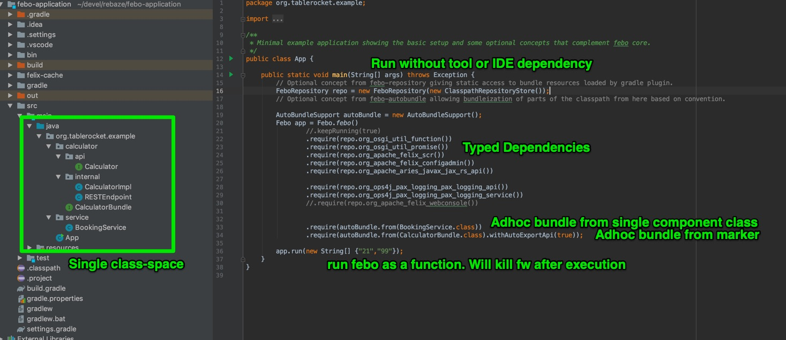

# Febo

Febo is a concept study for alternative ways to develop modular software.

Febo stands for "Felix Boot" but the project has evolved since that, so it is not really meaning that anymore.

It is a set of independent concepts that may or may not make sense altogether at the moment.

## Concept Ideas

### Flat Class Space

### Run without tool or IDE plugin

### Typed Dependencies

### Optional isolation (adhoc bundling)

### Functional invocation

